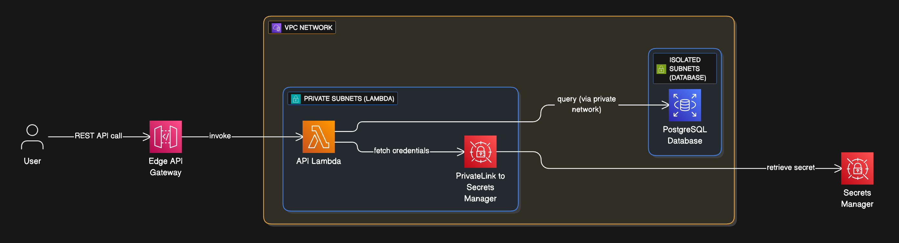
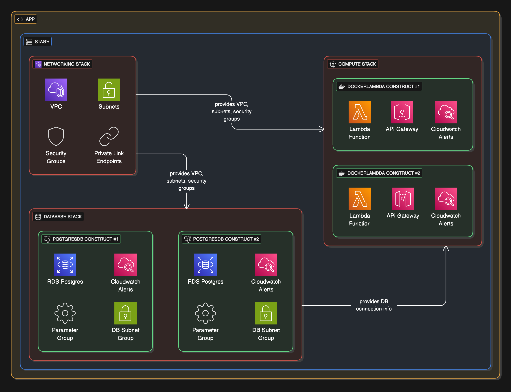

# 🎯 Reonic DevOps Challenge - Submission

## 🏗️ How I approached the task

### 🚀 The Start: Initial Architecture Design

**First**, I designed a simple but secure architecture:

- **VPC network** with proper subnet segmentation
- **Private subnets** for Lambda functions
- **Isolated subnets** for database instances
- **VPC Endpoint** to Secrets Manager for secure internal access
- **Lambda functions** in private subnets with restricted security groups
- **RDS PostgreSQL** in isolated subnets, only accessible from Lambda
- **Database credentials** managed through Secrets Manager
- **Edge API Gateway** exposing a REST API backed by the Lambda function



**Second**, I translated this architecture to CDK by creating several stacks:
- **Networking Stack**: VPCs, subnets, security groups, and VPC endpoints
- **Database Stack**: RDS instances, database subnet groups, and parameter groups
- **Compute Stack**: Lambda functions and API Gateway

**Third**, I setup a GitHub Actions pipeline with two main jobs:

1. **Build and Push Docker Image:**
   - Builds the Node.js application and creates the docker image
   - Creates AWS ECR Repository if it doesn't exist
   - Pushes docker image to ECR Repository with proper tagging

2. **Deploy Infrastructure & Lambda Function:**
   - Compiles the CDK stacks and deploys infrastructure to AWS
   - Handles environment-specific deployments based on branch
---

### ⚡ The Challenge: Scaling and Multi-Environment Support

After finishing the initial solution, I realized it had limitations:

- **Scalability Issue**: The CDK repo could only manage a single Lambda function and one database
- **Multi-environment Complexity**: Managing multiple environments created messy resource naming and configuration
---

### 🔧 The Solution: Refactoring for Scale

I restructured the entire project using a **stage → stack → construct** pattern:



#### Reusable Constructs
- **Docker Lambda**: Opinionated construct with API Gateway integration and sensible defaults
- **Postgres Database**: Environment-specific configurations with proper subnet groups and security
- **Monitoring**: Comprehensive CloudWatch alarms for Lambda, API Gateway, and RDS with SNS notifications

#### Scalable Stack Architecture
- **Compute Stack**: Can now create multiple lambda functions with just a few lines of code
- **Database Stack**: Easy to spin up multiple postgres databases with consistent configurations
- **Network Stack**: Centralized VPC, subnet, and security group management

#### Environment Management
- **CDK Stages**: Used AWS CDK Stage construct to create completely isolated dev and prod environments
- **Configuration-driven**: Simple config file to differentiate between dev and prod environments
- **Branch-based deployment**: Dev branch → dev environment, main branch → prod environment
- **Complete separation**: Each stage deploys its own set of stacks, environments are fully isolated

#### Monitoring and Deployment Strategy
- **Comprehensive monitoring**: CloudWatch alarms for Lambda errors/duration, API Gateway 4XX/5XX errors/latency, and RDS CPU/storage metrics
- **Alert notifications**: SNS email subscriptions for all critical system health alerts
- **Safe production deployments**: CodeDeploy canary deployments roll out changes to 10% of traffic over 5 minutes with automatic rollback on alarm triggers

---

## 📝 Assumptions and Trade-offs

### Assumptions

- **Regional Strategy**: Assumed as Reonic is a German Company, we'd want to host production in Frankfurt to comply with German data regulation and protection laws
  - Even though it's not the most cost-efficient region, compliance was prioritized
  - However, dev environment is hosted in N. Virginia since it's the most cost efficient for development work

- **Database Secret Format**: Had to assume the database secret parser in the original code had a misspelling
  - The code referenced `secret.database` but RDS auto-generated secrets use `secret.dbname`
  - Updated the handler code to support RDS auto-generated format `secret.dbname` for flexibility

- **No Internet Connectivity Required**: Determined that Lambda functions in this solution don't need internet access, so I removed NAT Gateways to reduce costs
  - Database connections are internal VPC traffic
  - Secrets Manager access goes through VPC Endpoint
  - If a Lambda function requires internet access, NAT Gateways can be enabled at the config level with `config.vpc.enableInternet`
---

### Trade-offs

- **SSL Connection**: Turned off SSL for postgres v15 instead of setting up SSL connection between Lambda and RDS
  - This avoided heavy changes to database connection setup in lambda function in case it was out of scope
  - Recognized this as a security trade-off for development speed

- **Authentication Method**: Used GitHub Actions secrets with Access Keys
  - Instead of setting up more secure OIDC connection between GitHub and AWS
  - Simpler approach but less secure than best practices would suggest

- **Connection Management**: Avoided using RDS Proxy for better connection pooling and management with IAM Authentication
  - Would require significant code changes and couldn't use the existing secret string with DB connection info
  - Decided to keep the simpler direct connection approach for this implementation

- **Database Isolation**: Assumed every database instance would be isolated with no inter-database connections
  - Each database gets its own subnet group and parameter group for complete isolation
  - Simpler security model with clear boundaries

- **Lambda-to-API Gateway Mapping**: Assumed each Lambda function would require its own dedicated API Gateway
  - Each lambda function gets its own API Gateway with a single proxy route
  - Simpler to manage permissions, routing and monitoring per function

---

## 🧪 How to test the solution

**Live Demo Endpoints:**
- **Dev Environment**: https://sickak8gy8.execute-api.us-east-1.amazonaws.com/dev/
- **Prod Environment**: https://qfal34utr0.execute-api.eu-central-1.amazonaws.com/prod/

**Test Commands:**
```bash
# Test dev environment
curl https://sickak8gy8.execute-api.us-east-1.amazonaws.com/dev/

# Test prod environment
curl https://qfal34utr0.execute-api.eu-central-1.amazonaws.com/prod/
```

**Expected Response:**
```json
{
  "message": "Successfully inserted record and retrieved count",
  "insertedId": 1,
  "totalRecords": 1,
  "timestamp": "2025-01-01T12:00:00.000Z"
}
```

**Verification:**
- Run the curl command multiple times and watch the `totalRecords` count increase
- This confirms Lambda is connecting to RDS and inserting data successfully
- Both environments demonstrate the multi-region deployment (dev: us-east-1, prod: eu-central-1)
---

## ⚙️ How to deploy your own instance

### A. Prerequisites

1. **Repository Setup:**
   - Fork the repo to your GitHub account
   - Clone your fork locally
   - Create a branch called `dev` from main

2. **AWS CLI Setup:**
   ```bash
   # Install and configure AWS CLI
   aws configure
   # Enter your Access Key ID, Secret Key, and default region
   ```

3. **Bootstrap CDK (Required - Admin Access Needed):**
   ```bash
   cd cdk
   # Bootstrap dev region
   AWS_REGION=us-east-1 cdk bootstrap

   # Bootstrap prod region
   AWS_REGION=eu-central-1 cdk bootstrap
   ```
   **Note:** This is a **one-time setup** that creates CDK toolkit infrastructure (S3 buckets, IAM roles) in each region. Must be done by someone with **Admin** or **PowerUser** access before any CDK deployments.

4. **Environment Configuration:**
   - Edit `config/environment-config.ts` with your preferences for dev and prod
   - **Important**: Update the `alertEmail` field with your email address:
     ```typescript
     monitoring: {
       alertEmail: "your-email@example.com",
     }
     ```
---

### B. Local Infrastructure Testing

1. **Install Dependencies:**
   ```bash
   npm run install:all
   npm run build
   ```

2. **Test CDK Infrastructure:**
   ```bash
   # Synthesize CloudFormation templates to check for errors
   cdk synth "dev/**"    # Test dev stage
   cdk synth "prod/**"   # Test prod stage

   # Check what changes would be applied (dry run)
   cdk diff "dev/**"     # Compare dev against deployed
   cdk diff "prod/**"    # Compare prod against deployed

   # Deploy locally for testing (optional)
   cdk deploy "dev/**"
   ```
---

### C. GitHub Actions Deployment

1. **Enable GitHub Actions** on your repository

2. **Create a dedicated IAM user for GitHub Actions:**
   - **Important:** CDK bootstrap prerequisite should be completed first by a developer/admin with **`PowerUserAccess`** or **`AdministratorAccess`** before setting up GitHub Actions.

   - **AWS Policies Required:**
     - **AWS managed policy for ECR operations: `AmazonEC2ContainerRegistryPowerUser`** 

     - **Custom policy for CDK role assumption:**
       ```json
       {
         "Version": "2012-10-17",
         "Statement": [
           {
             "Effect": "Allow",
             "Action": ["sts:AssumeRole"],
             "Resource": ["arn:aws:iam::*:role/cdk-*"]
           }
         ]
       }
       ```

3. **Configure Required Secrets/Variables:**
   **Repository Secrets:**
   - `AWS_ACCESS_KEY_ID`
   - `AWS_SECRET_ACCESS_KEY`

   **Repository Variables:**
   - `DEV_AWS_REGION` (ex: us-east-1)
   - `PROD_AWS_REGION` (ex: eu-central-1)

4. **Push to trigger GitHub Actions Workflow**
   - Push to `dev` branch → triggers development deployment
   - Push to `main` branch → triggers production deployment
---


## 💡 What I would improve with more time

#### Security Enhancements
- Setup IAM Roles for CDK Deploy with OIDC integration instead of GitHub Actions secrets
- Enable SSL connections between Lambda and RDS
- Implement RDS Proxy with IAM Authentication for better connection pooling and security
- Create dedicated database user with limited permissions instead of admin credentials

#### Operational Improvements
- Add integration tests in the CI/CD pipeline to test deployed API endpoints
- Setup centralized logging and structured log aggregation for better debugging
- Implement automated database schema migrations

#### Architecture Flexibility
- Make constructs more flexible to allow resource sharing when appropriate
- Allow multiple databases to share subnet groups when inter-database connectivity is required
- Allow multiple databases to share extensible parameter groups that are typed to database engine and instance class
- Enable Lambda functions to share API Gateways with route-based configuration allowing more complex solutions
